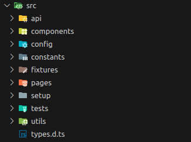

[Back to README](/README.md)

# Directory Structure Overview
The following is an overview of the project's folder structure, detailing the purpose and contents of each directory. This will help new developers quickly understand how the project is organized and where to find specific components.

  

This structure is designed to make the project modular, maintainable, and easy to navigate, especially for new developers joining the team. Each directory has a clear and specific purpose, ensuring that the project remains organized as it scales.

## API
|  |  |
| --------- | ------- |
| **Directory** | `api/` |
| **Purpose**   | Contains classes used for interacting with the server API directly. |
| **Use Case**  | Primarily used to set up data before a test, bypassing the UI. This allows for faster and more efficient test setups. |
| **Examples**  | `authenticateUsers.js`, `validateEnvData.js`, `createTestData.js,` etc. |

## Pages
|  |  |
| --------- | ------- |
| **Directory** | `pages/` |
| **Purpose**   | Houses the Page Object Model (POM) classes, representing individual pages within the OpenBoxes application. |
| **Use Case**  | Each class corresponds to a specific page or workflow within the application, such as the Inbound List Page or Inbound/Outbound Create Workflow. |
| **Examples**  | ListPage, CreateInboundPage, CreateOutboundPage, etc. |

## Components
|  |  |
| --------- | ------- |
| **Directory** | `components/` |
| **Purpose**   | Similar to the Pages directory but focuses on generic components rather than full pages. |
| **Use Case**  | These classes represent reusable components within the application, like common input fields, wizard steps, or the navigation bar. |
| **Examples**  | InputComponent, WizardStepComponent, NavbarComponent, etc. |

## Constants
|  |  |
| --------- | ------- |
| **Directory** | `constants/` |
| **Purpose**   | Contains common static variables used throughout the application. |
| **Use Case**  | These constants ensure consistency across tests by centralizing values like shipment types, location type codes, and user roles. |
| **Examples**  | ShipmentTypes, LocationTypeCodes, UserRoles, etc. |

## Utilities
|  |  |
| --------- | ------- |
| **Directory** | `utils/` |
| **Purpose**   | A collection of helper functions used across the project. |
| **Use Case**  | Provides utility functions that simplify common tasks and operations, reducing code duplication. |
| **Examples**  | Date manipulation functions, data formatting utilities, etc. |

## Fixtures
|  |  |
| --------- | ------- |
| **Directory** | `fixtures/` |
| **Purpose**   | Sets up POM classes for easy access within tests. |
| **Use Case**  | Simplifies test scripts by allowing pre-initialized POM classes to be accessed directly from test parameters. |
| **Examples**  | [More info here](/documentation/Fixtures.md) |

## Setup
|  |  |
| --------- | ------- |
| **Directory** | `setup/` |
| **Purpose**   | Contains scripts that are run before all tests to prepare the environment. |
| **Use Case**  | Ensures that the necessary data and configurations are in place before tests execute. Includes tasks like authenticating users, validating .env file data, and creating specific data for test runs. |
| **Examples**  | authenticateUsers.js, validateEnvData.js, createTestData.js, etc. |

## Configuration
|  |  |
| --------- | ------- |
| **Directory** | `config/` |
| **Purpose**   | Holds configuration files for the test application. |
| **Use Case**  | Validates and manages provided data such as user roles or supported activities in specific locations, ensuring the test environment is correctly set up. |
| **Examples**  | rolesConfig.js, locationActivitiesConfig.js, etc. |

